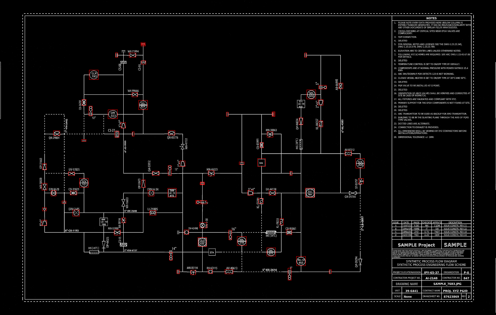
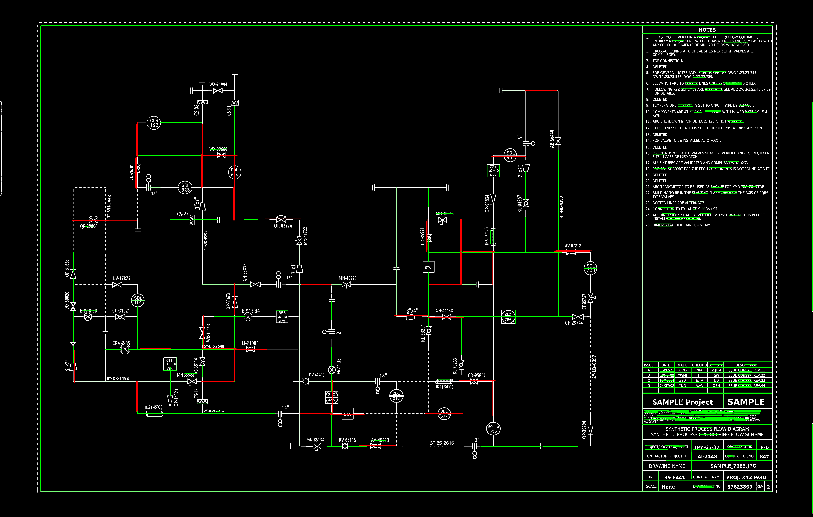
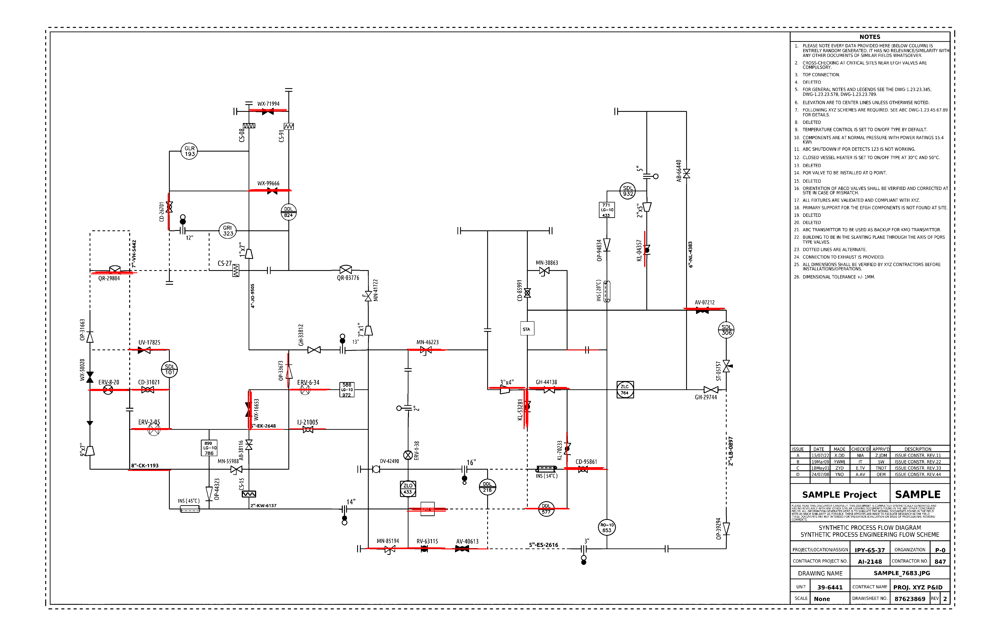
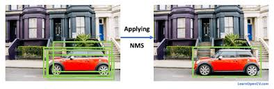

# P\&ID Annotation

## First steps

My first step was to properly define the dataset, so I wrote a script to load the annotations and convert it into a JSON. 
I tried training a yolov8n locally on macOS first, but two problem plagued me -> I was not familiar with yolo format and training on MPS was really slow. I kept getting label errors and my system froze at one point.

So after this I converted the dataset into zip files and uploaded to huggingface (This makes it really easy to download on cloud GPUs, taking ~10s to download 1 GB. I used a RTX 4090 on https://vast.ai/products/gpu-cloud for these experiments).
I then went ahead with Pytorch Faster R-CNN model, and since I already had the annotations, it was easy to use a pytorch dataset and dataloader.
I was confused on what was the difference between `line` and `line2`, so i visualized the bounding boxes and found out that `line2` is the boundary lines for the whole diagram.

## Approach 1 - [notebook](./notebooks/individual.ipynb)

I used a single R-CNN for all categories and treated each symbol as a separate class. So there were effectively 35 classes (1 background, 32 symbols, 1 word, 1 line). I didn't apply any preprocessing for this yet. 

Results -

```comment
mAP (mean Average Precision): 0.1665
Mean IoU: 0.6643
Mean Precision: 0.1665
Mean Recall: 0.0166
Mean F1-Score: 0.0279
Average Inference Time: 0.0593 sec/image
```

on inspecting the individual symbol metrics, only 3 symbols were getting detected. this meant that if we treat each individual symbol as a separate class, the model struggles to learn the rarer classes.

## Approach 2 - [notebook](./notebooks/unified.ipynb)

Treating all symbols as 1 class -> so total classes becomes 4.  
Using a single model for all 4 classes.

Results -

```comment
symbol - Precision: 0.927, Recall: 0.225, F1: 0.362
word - Precision: 0.819, Recall: 0.109, F1: 0.193
line - Precision: 0.000, Recall: 0.000, F1: 0.000

=== FINAL RESULTS ===
mAP (mean Average Precision): 0.5821
Mean IoU: 0.6696
Mean Precision: 0.5821
Mean Recall: 0.1114
Mean F1-Score: 0.1849
Average Inference Time: 0.0705 sec/image
```

Symbols are getting recognized better, and mean metrics improve.

## Adding preprocessing to Approach 2 - [notebook](./notebooks/unified-gbh.ipynb)

I added greyscale and binarization to images before training.  

Results -

```comment
symbol - Precision: 0.898, Recall: 0.226, F1: 0.361
word - Precision: 0.627, Recall: 0.149, F1: 0.240
line - Precision: 0.000, Recall: 0.000, F1: 0.000

=== FINAL RESULTS ===
mAP (mean Average Precision): 0.5083
Mean IoU: 0.5685
Mean Precision: 0.5083
Mean Recall: 0.1248
Mean F1-Score: 0.2004
Average Inference Time: 0.0732 sec/image
```

Recall and F1 barely improve. This meant that using the same preprocessing for all 3 tasks is not working well.  
In this context, task defines to either `symbol`, `word`, `line`.

## Approach 3 - [notebook](./notebooks/multi.ipynb)

I used separate models for each task, along with unique preprocessing for each.  

Results -

```comment
--- SYMBOL RESULTS ---
mAP: 0.9209
Mean IoU: 0.7551
Precision: 0.9209
Recall: 0.6991
F1-Score: 0.7948
Inference Time: 0.0292 sec/image

--- WORD RESULTS ---
mAP: 0.3669
Mean IoU: 0.3624
Precision: 0.3669
Recall: 0.1085
F1-Score: 0.1674
Inference Time: 0.0294 sec/image

--- LINE RESULTS ---
mAP: 0.0376
Mean IoU: 0.0459
Precision: 0.0376
Recall: 0.0139
F1-Score: 0.0203
Inference Time: 0.0585 sec/image
```

Symbols are most benefitted by this approach. Precision is similar, but F1 score jumps from 36% to 80%, which means that many more symbols ar e now getting recognized.
Performance for `word` decreases, but performance for `line` becomes a little bit better.

## Visualization of approach 3

### Original Image

  

### Symbol Detection  

  

### Line detection

  

### Word Detection

  

As you can see, most of the symbols are recognized. About 40% of the lines are detected(ignoring `line2` and tables).  
The text detection is very bad and only OCR can help us here.

## Future improvements

I found this blog which was very interesting - https://devblogs.microsoft.com/ise/engineering-document-pid-digitization  
It refers to a research paper - https://academic.oup.com/jcde/article/9/4/1298/6611631?login=false

1. Using a OCR model for the `word` task would be much better than an object detection model. Maybe adding a VLM would help in understanding how the text is associated with certain symbols/elements, along with extracting structured texts like the `table` and `keyValue`
2. I tried the Standard Hough Transform algorithm mentioned in the blog but I felt other algorithms/transforms could be explored further for getting line detection right.
3. Of course, training for more epochs would help, since I only trained for 10 epochs.
4. The research paper that is mentioned in the blog is insightful on how to improve performance.
    - They train two networks separately for small and big symbols separately. (Big symbols on 1/8th scaled down images and Small symbols on segmented patches. Using any one method for both small and big symbols would worsen the detection for the other.)
    - They use a postprocessing technique called NMS - Non Maximum Suppression. This technique eliminates multiple false positive bounding boxes by selecting the most relevant bounding box.  
    
    - For lines, they remove any lines that overlap or touch the `symbol` or `word` areas. Only pure continuous lines are used. Again, since the size of lines is small, the image is segmented into smaller patches before detection.
    - For Text, the image is segmented into patches, and then Tesseract is used for OCR. They found that it doesn't detect vertical images properly, so they identify vertical texts by determining the aspect ratio of the bounding box (very simple but innovative method) and rotate it. OCR performance improved by only feeding horizontal texts. (This point can be proved by looing at our text detection, 90% of the text detected is horizontal, even when our performance is very bad.)
    - The paper continues on flow detection, graph generation, P&ID parsing too, which are downstream tasks and not required as of now.

## Code Explanation

- Use `setup.sh` to clone the repo, install requirements and download the processed dataset.

- Detection tasks are split into **three tasks** - `symbol`, `word`, `line`  
  - For simplicity, **all symbols are treated as a single class** (`unified`) instead of individual symbol types.

- **Faster R-CNN with ResNet50-FPN backbone** is used for all tasks.
  - Symbols: 2 classes (background + symbol)
  - Words: 2 classes (background + word)
  - Lines: 2 classes (background + line)

- `load.py` parses all `.npy` files and creates `.json` files for annotations, which makes it easier to load, instead of parsing every time while training. (not needed unless using raw dataset)

- `PIDJSONDataset` class:
  - Handles JSON parsing, box sanitization(i added this because some bounding boxes were too small, so had to make them atleast the minimum size), and preprocessing.
  - Can filter by task (`symbol`, `word`, `line`, or `all`).

- `get_dataloaders` function creates PyTorch DataLoaders for training, validation, and testing.

- Training is **task-wise**, i.e., one model per task.
- Configuration:

```python
config = {
    "batch_size": 4,
    "epochs": 10,
    "learning_rate": 0.001,
    "train_split": 0.7,
    "val_split": 0.2,
    "test_split": 0.1,
    "iou_threshold": 0.5,
    "confidence_threshold": 0.5,
}
```
